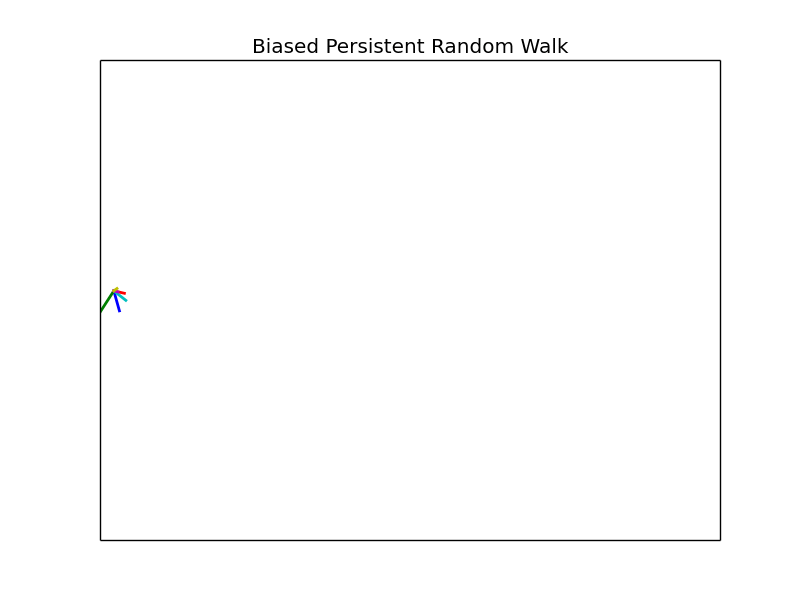

Random walks have been used to study many phenomena in biology and ecology. Here I present a model of a biased and persistent random walk with the goal of using it to study cell chemotaxis.

In its simplest form a [random walk](https://en.wikipedia.org/wiki/Random_walk) involves a walker that periodically moves a fixed distance. What makes the walk random is the direction in which the walker moves. In one dimension the walker can move left or right. In two dimensions it can move left, right, up, or down, and so on. Every time the walker makes a move, it is equally likely to do so in any of the possible directions.

With these basic rules many interesting statistical properties like the *mean displacement*
$\langle \vec{r} \rangle$,
and *mean squared displacement*
$\langle r^2 \rangle$
of the random walker can be derived.
Simulations, similar to the one pictured above, can be used to verify predictions.

## Biased Persistent Random Walk

There are two key components that differentiate a biased persistent random walk (BPRW) from an ordinary random walk.

First is the bias. The bias means that one particular direction of movement is favored over the other. For example, in 1D that would mean that moving left or right does not occur with equal probability. Instead one direction would occur with probability greater than 50%, and vice versa for the other direction.

The bias in a random walk is essential for modeling cell chemotaxis since it represents the cell's preferred direction of motion caused by some chemical gradient in its environment.

The second feature of the BPRW is persistence. Persistence means that the walker prefers to keep moving in the direction it was already going. This can be thought of as the walker having some inertia which causes it to want to keep moving in the same direction it was previously going. In the case of a purely persistent random walk, when the walker goes to move a new move its previous direction is more likely to occur than all other possible directions, which between themselves are equally probable.

The persistence is necessary capture the natural motion of cells which do not turn on a dime as an ordinary random walker would. The two features of bias and persistence together provide a simple model for studying cell chemotaxis.  
