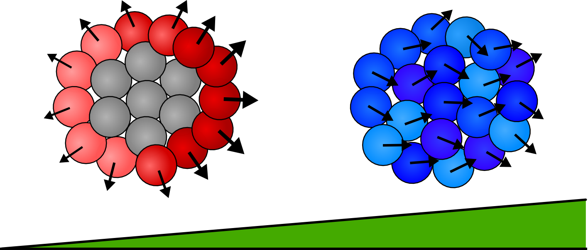

Our study of multicellular chemotaxis was recently published in [**Physical Review Letters**](https://journals.aps.org/prl/abstract/10.1103/PhysRevLett.119.188101).
The work compares two typical methods of collective chemotaxis in order to determine which one is more accurate in tracking chemical gradients.
